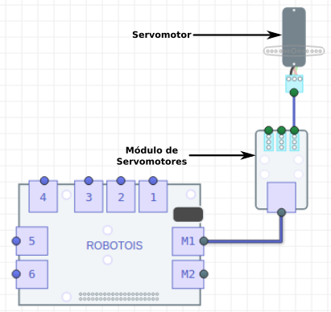

# Cómo Empezar
Un Servomotor consiste en un mecanismo que contiene un motor y un sistema de control para que éste se ubique en una posición específica dentro de un rango. Normalmente, los Servomotores tienen un rango de operación de `(-90)-90` grados, es decir que tienen un alcance de `180` grados en total.

El Módulo de Servomotores contiene un sistema para controlar hasta tres Servomotores. Este módulo es un dispositivo basado en un controlador con salidas **PWM** (*Pulse Width Modulation*), el cual es configurado por la **Raspberry PI** para que éste proporcione la señal adecuada con base en la ubicación deseada en el Servomotor.

La comunicación de este módulo con la **Raspberry PI** se realiza a través del puerto **IIC**, de esta manera se simplifica el uso de los Servomotores, ya que a través de esta librería se mandan instrucciones simples con la posición (en grados) que se desea obtener en el Servomotor.

## Instalación de la librería
Para instalar la librería se tienen dos opciones, una es usar el gestor de paquetes [**npm**](https://www.npmjs.com/package/robotois-servos) y la otra es descargar la última versión disponible en [**GitHub**](https://github.com/Robotois/robotois-servos). La instalación se realiza de la siguiente manera:

* Con **npm**:
```shell
npm install robotois-servos
```

* Usando **GitHub**:
```shell
npm install git+https://github.com/Robotois/robotois-servos.git
```

## Conexión al Shield
Como se mencionó anteriormente, la comunicación con la **Raspberry PI** se realiza a través del puerto **IIC**, y se deben usar los puertos `M1-M2` del Shield, ya que éstos han sido destinados para módulos que controlan dispositivos electromecánicos.

En la siguiente imagen se ilustra cómo se realiza la conexión de este módulo y el Shield:



## Establecer ángulo con `setAngle()`
En esta librería, para establecer el ángulo de un Servomotor se utiliza solo una función, `setAngle()`. Es bastante simple utilizar dicha función, ya que ésta recibe como parámetros el número del servomotor al cual se va a establecer el ángulo y el ángulo como tal. Los puertos de Servomotores se encuentran numerados de la siguiente manera `SERVO1`, `SERVO2` y `SERVO3`, consecuentemente en la función `setAngle()` el puerto del Servomotor se especifica con su respectivo número `1-3`.

A contuniación se muestra un ejemplo sencillo de cómo establecer el ángulo de un Servomotor, en donde se observa que es bastante simple hacerlo.

```javascript
const Servos = require('robotois-servos');

const servos = new Servos();

let angle = 0;
let sum = 10;

setInterval(() => {
  servos.setAngle(1, angle);
  if (angle === 90) {
    sum = -10;
  }
  if (angle === -90) {
    sum = 10;
  }
  angle += sum;
}, 250);
```

En el ejemplo anterior se puede observar que para el Servomotor, que está conectado en el puerto `1`, su posición se rota en un rango de `(-90)-90` grados. De esta manera, la libreía proporciona lo necesario para controlar Servomotores, ya básicamente solo es necesario especificar el ángulo deseado.

Para este módulo solo se tiene la función `setAngle()` para configurar el ángulo de un Servomotor, no obstante de manera interna esta librería se cuenta con las funciones necesarias para transformar el ángulo en *grados* a un parámetro que el controlador *PWM* puede interpretar y así proporcionar la señal que el Servomotor puede utilizar.
